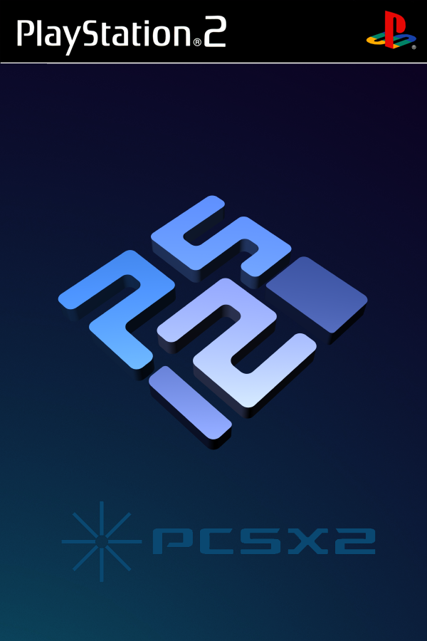

# Disc Playlist Generator 
[](https://www.gnu.org/licenses/gpl-3.0)


**Disc Playlist Generator** is a simple Python utility designed to automate the creation of m3u playlists for multi disc games used in emulators such as **Duckstation**, **PCSX2**, **RPCS3**, **Dolphin** and **CemU**.

The default supported ROM formats are: **.cso .iso .chd .rvz**. More file types can be added in the source code.

   &nbsp;&nbsp;
   &nbsp;&nbsp;
   &nbsp;&nbsp;

   &nbsp;&nbsp;

## Usage

* **Python** must be first installed in the system in order for the script to work. Apart from that no additional dependencies are needed.
* The file `disc_playlist_generator.py` must be placed on the same folder that contains all rom files.
* After executing the script, all the files in the folder will be scanned and, if multiple files exist of the same game, a new folder with the game name will be created\*. All game files will be moved to that folder and a `.m3u` playlist will be created containing all disc names.
* `.m3u` will also be added to the folder name because some emulation frontends need that in order to display the all files as a single game.
  
**\*** The character used for delimiting the game name can be changed with a command line argument specified in the next section. The default one is **\)**

## Arguments
The default execution of the script can be modified with the following arguments:

**-s** *"symbol"* : &nbsp;&nbsp;

Specifies the symbol used for delimiting a game name. The default one is \(.

**-b** : &nbsp;&nbsp; 

Removes the *.m3u* ending from folder names

## Example

Having the files:
```
Metal Gear Solid (USA) (Disc 1).chd
Metal Gear Solid (USA) (Disc 2).chd
```

The expected output would be:
```
Metal Gear Solid (USA).m3u
 └-> Metal Gear Solid (USA) (Disc 1).chd
 └-> Metal Gear Solid (USA) (Disc 2).chd
 └-> Metal Gear Solid (USA).m3u
```